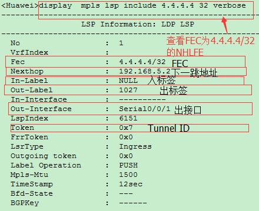
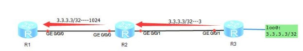
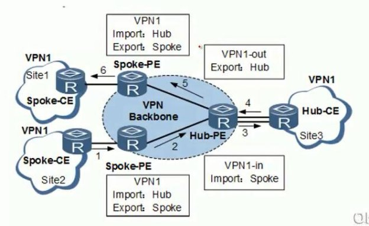

MPLS-rst
=========
一. MPLS优点：
--------------

**MPLS具有以下优点：**

① 根据标签快速转发

② 解决了BGP路由黑洞的问题

③
统一结构（在运行MPLS的网络中可以对从两边来的多种协议进行统一转发，例如FR；

VPN；BGP）

④ MPLS VPN的实现

⑤ MPLS TE流量工程

⑥ 实现多协议转发

二. MPLS报文：
--------------

MPLS报文总共4Byte，32bit。

|image1.jpeg|

1. **LABEL：**\ 20bit，用来显示标签号，可以使用2^20为1048576个标签号

**② EXP：**\ 3bit，Experimental Use，实验位，后期用来做QOS。

**③ S：**\ 1bit，Bottom of
Stack，栈底位，一个数据包可以打多层标签，采用协议栈进行打标签（先进后出模式），其中最外层为顶层标签，最里面的为底层标签，S的作用用来确定一个打了多层标签的数据包在弹出标签的时候是否已经完全的弹掉所有的标签。当标签中S位为1的时候，表示当前的标签已为最低层标签。

**④ TTL：**\ 8bit，用来防环。

三. MPLS角色：
--------------

在MPLS网络中，网络传输存在以下几组角色：

① LER

② LSR

③ PHP

④ LSP

1. LER：
~~~~~~~~

Label Edge
Router，标签边缘路由器，在MPLS网络中，位于网络边缘的路由器称之为LER。主要作用由于压入标签，弹出标签。

**① Ingress-LER：**\ 上游设备，压入（Push）标签的设备

**②
Egress-LER：**\ 下游设备，弹出（pop）标签的设备；Un-tag（存在多层标签时）全部弹出。

LER设备默认只为本地/32的路由生成标签：

-  在Ingress节点执行该命令时，触发所有的32位路由建立LDP LSP。

-  在Egress节点执行该命令时，触发本地32位路由建立LDP LSP。

2. LSR：
~~~~~~~~

Label Switch
Router，标签交换路由器，网络内部的路由器称之为LSR，主要作用为标签的交换，进行标签数据的转发。

① 接收到/32的路由条目，LSR会生成两条标签

-  本地发起的流量标签，入标签Null；出标签下一跳传来的标签

-  Transnet网络，入标签本地生成标签；出标签下一跳传来的标签

② 接收到除/32的路由条目外，只会作为Transnet网络

-  Transnet网络，入标签本地生成标签；出标签下一跳传来的标签

|image2.png|

① AR3在OSPF上引入静态路由[Huawei]ip route-static 30.30.30.30
255.255.255.0 NULL 0，使用命令[Huawei-mpls]lsp-trigger
all触发所有的本地路由建立LDP LSP，这条路由的标签传递给AR2

②
AR2作为Transnet网络，接收到30.30.30.30/24的标签映射，查看路由表存在这条路由，并且是从最优下一跳路由器得到的，所以只生成Transnet网络的标签映射

|image3.png|

③
AR2将FEC为30.30.30.30/24的标签传递给AR1，AR1上使用命令[Huawei-mpls]lsp-trigger
all，触发所有的路由建立LSP，所以此时会建立关于30.30.30.30/24的LSP，而中间的AR2只作为一个Transnet节点，无法直接发起流量

④ 如果在中间设备上使用命令[Huawei-mpls]lsp-trigger
all，触发所有的路由建立LSP，此时此设备可以作为一个LER设备，并生成一条起始于本地的LSP

|image4.png|

3. PHP：
~~~~~~~~

Penultimate Hop Popping,
次末节弹出，为网络中倒数第二跳路由器，主要作用为弹出标签发给末节路由器。

|image5.jpeg|

（1）过程：

①
PC1访问目的网络PC2，目标地址为8.8.8.8/32，R1为起始LER，压入标签，发送给R2，

②
R2发现自己位于次末跳路由器，于是弹出标签，发送给R3，R3通过路由表转发给PC2。

（2）优点：

① R3将直连PC（8.8.8.8）的路由条目标签置为3（特殊标签）传给R2

②
R2发出R3去往8.8.8.8的标签给R1，自己为去往8.8.8.8的次末跳路由器，于是out为

   NULL，标志着去往8.8.8.8时将弹出标签，交给R3为路由转发，提高了转发效率，节约了R3查看标签表去查询路由表的时间。

**注1：**\ 在特殊情况下，需要次末跳携带标签，例如在做QOS的时候，全MPLS做优先级转发，

此时就需要做显示空标签，不让次末跳弹出标签，所以可以配置为显示空标签和正常标签，当配置了显示空标签后，路由器会将直连路由标签设置为0，传递给邻居，当次末跳路由器收到路由包后，会将数据包的标签替换为0，传递给最后一跳路由器，最后一跳路由器当接收到Label为0的数据包后，不会查询标签转发表，而是会直接将Label剔除，查询路由表进行转发。如果想要正常的标签转发。

   **使用以下命令进行配置：**

[Huawei-mpls]label advertise explicit-null-显示空标签（最后一跳为0）

[Huawei-mpls]label advertise non-null------最后一跳携带标签（正常标签）

[Huawei-mpls]label advertise implicit-null-隐式空标签（PHP默认行为）

最后重置LDP刷新标签<Huawei>reset mpls ldp all

四. 标签转发过程：
------------------

|image6.jpeg|

①
流量数据包进入LSP中，Ingress-LER根据目的地IP地址，查看标签转发表，会将标签压入数据包中（位于二层和三层中间），并根据标签映射送入下一跳路由器。

②
下一跳路由器收到带有标签的数据包，查看标签，并根据标签转发表将标签替换，并在此送入下一跳路由器。

注1：由于MPLS没有水平分割的机制，所以路由器会根据路由表中所有的路由前缀生变标签发送给邻居

注2：
华为默认只会为\ **自身产生的/32环回接口**\ 分发标签,使用命令修改为所有的路由条目分配标签

[Huawei-mpls]lsp-trigger host-----默认，只为自身产生的Loop口生成标签

[Huawei-mpls]lsp-trigger all-----为路由表中所有的FEC生成标签

1.生成单项LSP：
~~~~~~~~~~~~~~~

Label switched Path ，标签交换路径，MPLS报文经过的路径称之为LSP。

一条LSP总是起于一台Ingress的LER，止于另一台Egress的LER，中间经过若干台被称之为Transit的LSR。

LSP具有单向性，标签只针对FEC进行标识，来回的FEC不一致，所以来回的Label可能不一致，所以LSP具有单向性

（1）NHLFE：

Next Hop Label Forwarding
Entry，下一跳标签转发表项，用于指导MPLS报文的转发

|image7.jpeg|

① FEC：转发等价类

② In-Label：本地标签

③ Out-Label：远程标签

④ Label Operation：标签操作

① FEC：

Forwarding Equivalence
Class，转发等价类，在转发过程中走相同路径、使用相同标签、相同

策略、相同的QOS服务，查同样路由的数据包的路由前缀地址。通常一个FEC分配唯一的

标签。例如一个网段的报文属于一个EEC，并分配一个本地唯一的标签。

**如何判断属于同一个FEC：**

1. 属于某特定组的组播报文

2. 目的IP地址匹配了某一个特定前缀的报文，根据IP路由表目的网段

3. 根据DCSP字段，有相同QOS策略的报文

4. MPLS VPN中，属于同一个VPN的报文

5. 报文的目的IP地址属于BGP学习到的路由，并且该路由的下一跳地址相同

② In-Label：

本地标签，自己产生；并传递给上一跳路由器，表示上一跳路由器去往FE时经过自己应该打什么标签。

③ Out-Label：

远程标签，出标签，代表去FEC目标时，送往下一跳路由器应该打入什么标签。

④ Label Operation：

标签操作，代表次路由器对去往FEC目标时对来的数据包执行什么样的操作。

**标签操作有三类行为：**

1. PUSH为压入标签

2. SWAP为交换标签

3. pop为弹出标签

（2）FTN：

FEC-to-NHLFE，FEC到一组NHLFE的映射称为FTN，通过查看FIB表中的Tunnel
ID值不为0x0的表项，能够获得FTN的详细信息。

FTN只在Ingress存在，用于FIB表中的Tunnel
ID对应NHLFE找到相应的动作和压入的标签。

（3）ILM：

Incoming Label
Map，入标签到下一组下一跳标签转发表项的映射称为入标签映射ILM

**LIM包括：Tunnel ID、入标签，出接口、 标签操作类型等信息**

LIM在Transit节点的作用是将标签和NHLFE绑定，通过标签索引ILM表，就相当于使用目的IP地址查询FIB，能够得到所有的标签转发信息

（4）Tunnel ID：

为了给使用隧道的上层应用（如VPN、路由管理）提供统一的接口，系统自动为隧道分配一个ID，也称为Tunnel
ID，该Tunnel ID的长度为32bit，只是对本地有效

2. 标签转发：
~~~~~~~~~~~~~

|image8.jpeg|

**Ingress：**

① R1访问4.4.4.4/32,生成数据包，由于没有MPLS标签，此时根据FIB表转发：

-  如果FIB表中的Tunnel ID为0x0,进入正常的IP转发流程

-  如果Tunnel ID不为0x0，进入MPLS转发

|image9.png|

② 确定4.4.4.4/32为MPLS转发后，根据FIB中的Tunnel
ID查找NHLFE表中一致的Tunnel ID

③ 找到NHLFE中和FIB一致的Tunnel
ID后，根据NHLFE中对应的动作，出标签，以及下一跳对数据报文进行处理

|image10.png|

**Transit：**

①
R2收到R1发送过来的报文，根据二层标识得知此数据包为MPLS报文，根据MPLS包头中的标签查看ILM表，根据ILM中的Tunnel
ID查找NHLFE表中一致的Tunnel ID

② 找到那个NHLFE中和ILM一致的Tunnel
ID后，根据NHLFE中对应的动作，出标签，以及下一跳对数据报文进行处理

**Egress:**

① 如果Egress收到IP报文，则查看路由表，进行IP转发

② 如果Egress收到MPLS报文，则查看ILM表获得标签操作类型，同时处理EXP和TTL

③ 如果标签中的栈底标识为S=1，表示已经到达栈底，直接进行IP转发

④ 如果标签中的占地标识为s=0，表明还有下一层标签，继续进行下一层标签转发

五. MPLS标签分类：
------------------

MPLS标签分为以下几类：

① 0-15：特殊标签

② 16-1023：静态LSP

③ 1024以上：动态分配使用

（1）特殊标签：
~~~~~~~~~~~~~~~

===================== ========================== ========================================================================================================================================================================================================================
**标签标号**          **标签名称**               **用途**
===================== ========================== ========================================================================================================================================================================================================================
**Label 0**           **IPv4显示空标签**         IPv4 Explicit NULL Label ，IPv4显示空标签，表示该标签必须被弹出，且报文的转发必须基于IPv4，当最后一跳路由器收到标签为0的数据包时，不会查看MPLS转发表，而是直接将标签弹出查看
                                                
                                                 IP表进行转发。
**Label 1**           **Router Alert Label**     只有出现在非栈底时才有效。类似于IP报文的“Router Alert Option”字段，节点收到Router Alert Label时，需要将其送往本地软件模块进一步处理。实际报文转发由下一层标签决定。如果报文需要继续转发，则节点需要将Router Alert Label压回标签栈顶。
**Label 2**           **IPv6显示空标签**         IPv6显示空标签，表示该标签必须被弹出，且报文的转发必须基于IPv6，当最后一跳路由器收到标签为0的数据包时，不会查看MPLS
                                                
                                                 转发表，而是直接将标签弹出查看IP表进行转发
**Label 3**           **隐式空标签**             隐式空标签，倒数第二跳LSR进行标签交换时，如果发现交换后的标签值为3，则将标签弹出，并将报文发给最后一跳。最后一跳收
                                                
                                                 到该报文直接进行IP转发或下一层标签转发
**Label 4到Label 13** **保留**                   保留
**Label 14**          **OAM Router Alert Label** MPLS OAM（Operation Administration & Maintenance）通过发送OAM报文检测和通告LSP故障。OAM报文使用MPLS承载。OAM报文
                                                
                                                 对于Transit LSR和倒数第二跳LSR（penultimate LSR）是透明的
**Label 15**          **保留**                   保留
===================== ========================== ========================================================================================================================================================================================================================

（2）静态LSP：
~~~~~~~~~~~~~~

16-1023为配置静态LSP使用

（3）动态LSP：
~~~~~~~~~~~~~~

1024以上为配置动态标签使用

六. 静态MPLS：
--------------

静态MPLS是用户通过手工为各个转发等价类分配标签而建立的。手工分配标签需要遵循的规则是：（目标网段）下游节点的入标签就是上游节点的出标签

由于静态LSP各节点上不能相互感知到整个LSP的情况，因此静态LSP是一个本地概念

静态LSP不使用标签分发协议，不需要交互控制报文，因此消耗资源比较小，适用于拓扑简单并且稳定的小型网络。单通过静态方式分配标签建立LSP不能根据网络拓扑变化动态调整，需要管理员干预，静态LSP不能使用特殊标签。

**注：**\ 因为In-LER需要查看FIB的Tunnel
ID再去查看MPLS转发表，所以In-LER配置静态MPLS需要满足两个条件：

-  命令中的下一跳为IGP路由的下一跳

-  FEC存在于IGP路由表中

..

   如果不满足上述两种条件，则在查看LSP表时状态为down，而在LSR中，由于存在标签，所以直接查看ILM表项进行转发，所以不需要关心路由是否可达，所以直接根据标签转发表转发即可，静态LSP中，LER设备的下一跳LSP路径是不可控的，而中间的LSR路径是可控的，LSP的长度是可控的。Huawei设备Transnet节点也要配置next
   hop字段，但是不需要满足路由表的下一跳，因为中间额Transnet几点并不知道数据包的目标IP，所以中间的LSR路径时可控的，配置Next
   hop字段的下一跳原因为：

-  Broadcast网络中，当同一链路对应多个邻居，由于Transnet
   LSR并不知道目标IP地址，所以只表明出接口，但ARP表项一个接口对应多个目标MAC，所以路由器并不知道二层的MAC地址应该封装哪一个目标MAC

-  FR网络，同一个链路对应多条PVC，Transnet
   LSR并不知道目标IP地址，所以只表明出接口，所以路由器并不知道应该封装哪一个PVC

..

   实际设备并不检查二层MAC和PVC问题，所以即使不配置Next
   hop字段LSP也会处于UP状态，但是数据平面数据包无法封装二层字段，所以数据包会被丢弃

七. LDP：
---------

Label Distribution Protocol，标签分发协议，可以实现动态的标签分配。

1. LDP报文类型：
~~~~~~~~~~~~~~~~

LDP分为多种报文，总共分为四大类，每种LDP报文都包含相同的头部信息，全部使用四层（TCP、UDP）进行封装

UDP类型报文组播地址为224.0.0.2，源端口目标端口都为646

TCP类型报文使用单播，源端口随机，目标端口646

LDP包含公告头和具体报文头，每种消息类型使用TLV进行标示

**公共头部信息：**

|image11.png|

**① Version：**\ 2字节 表示版本号。目前LDP的版本号始终为1。

**② PDU Length：**\ 2字节 表示PDU的总长度，包括LDP
ID和整组LDP消息，不包括Version和PDU Length字段。

**③ LSR-ID：**\ 4字节 LDR-ID标识一台LSR，必须全局唯一。

**④ Liber Space ID：**\ 2字节
标识了LSR内的标签空间。对于平台范围标签空间，这些数值都应当为0

**⑤ Bunch of messages：**\ 变长
是一组LDP消息的集合，可以是一个或者多个LDP消息。

-  当LDP报文以UDP方式传输时，“Bunch of messages”只能是Hello消息的集合。

-  当LDP报文以TCP方式传输时，“Bunch of
   messages”可以是除Hello消息外任意类型的LDP消息的集合。

**具体报文头信息：**

|image12.png|

**① U ：**\ 1比特，未知的消息，如果对端收到的LDP消息中“Message
type”字段为未知的LDP消息类型，且“U”字段的值为“0”，则向源端发送通知（Notification）消息。如果对端收到的LDP消息中“Message
type”字段为未知的LDP消息类型，且“U”字段的值为“1”，则忽略该未知消息。

**② Message Type：**\ 15比特 LDP消息的类型。

**③ Message Length：**\ 16比特 LDP消息的长度，是Message
ID、强制参数和可选参数的长度的总和。

**④ Message ID：**\ 32比特 LDP消息的编号，用于唯一地标识一个LDP消息。

**⑤ Mandatory Parameters：**\ 变长 LDP消息的强制参数。

**⑥ Optional Parameters：**\ 变长
LDP消息的可选参数，包含0~n个TLV。由于LDP报文类型繁多，所以将LDP报文分为四大类，每一类表示不同的作用。

**主要分为以下几类：**

① Discovery message发现消息

② Session message链接消息

③ Advertise message通知消息

④ Notification message通告消息

==========================
===================================================================
===================
=========================================================================
**分类**                   **作用**                                                            **消息类型**        **具体作用**
==========================
===================================================================
===================
=========================================================================
**Discovery message类**    发现消息，宣告和维                                                  Hello报文           LDP发现机制中宣告本LSR并发现邻居
                                                                                                                  
                           护网络中一个LSR的                                                                      
                                                                                                                  
                           存在，使用UDP发送                                                                      
                                                                                                                  
                           hello消息维护邻居                                                                      
**Session message类**      链接消息，用于建立、维护和终止LDP 邻居间的LDP 信息传递，使用TCP传输 Initialization      初始化报文，在LDP Session建立过程中，协商参数，如果协商通过，完成LDP Peer
                                                                                                                  
                                                                                                                   的协商
\                                                                                              Keep Alive          监控LDP Session的
                                                                                                                  
                                                                                                                   TCP连接的完整性
**Advertise message类**    通知消息，生成、改变和删除FEC的标签映射，使用TCP传输                Address             宣告路由器之间口地址
\                                                                                              Address Withdraw    撤销路由器之间接口地址
\                                                                                              Label Mapping       宣告FEC/Label映射消息
\                                                                                              Label Request       请求FEC的标签映射
\                                                                                              Label Abort Request 终止为完成的Label
                                                                                                                  
                                                                                                                   Request Message
\                                                                                              Label Withdraw      撤销FEC/Label映射
\                                                                                              Label Release       释放标签
**Notification message类** 通告消息，宣告告警和错误信息                                        Notification        通知LDP Peer错误信息
==========================
===================================================================
===================
=========================================================================

（1）Discovery message类：

发现消息，宣告和维护网络中一个LSR的存在，使用UDP发送hello消息维护邻居

① Hello：

Hello报文使用Common Hello Parameters TLV和IPv4 Transport Address TLV标示

LDP发现协议中宣告本LSR并发现邻居，每隔5S发送一次，15S失效，如果两端时间不一致，

则取时间小的Hello时间为标准，UDP封装，本地地址为单播IP：646，对端目标地址为

224.0.0.2:646

注：基本发现中Hello包只能与直连链路上的Peer建立邻居，当配置远端Peer时，此时目

   端的LSR-ID地址,ransport Address为创建TCP
   session使用的目标地址，默认使用LSR-ID地址，所以在配置LSR-ID时，需要使用实际接口IP

|image13.png|

1. **公共Header**

2. **协议报文Header**

3. **Common Hello Parameters TLV：**

-  **Type：**\ 类型

-  **Length：**\ 长度

-  **Hold Time：**\ Hello老化时间

-  **Hello类型：**\ 直连链路为Link Hello

-  **GTSM：**\ 置位符，标示是否使用GTSM功能

1. **IPv4 Transport Address TLV**\ ：

-  **Type：**\ 类型

-  **Length：**\ 长度

-  **IPv4 Transport Address：**\ 连接地址（默认为LSR-id）

（2）Session message类：

链接消息，用于建立、维护和终止LDP 邻居间的LDP 信息传递，使用TCP传输。

① Initialization：

初始化报文，在LDP Session建立过程中协商参数，如果协商通过，完成LDP
Peer的协商，

使用Common Session Parameters TLV进行承载

|image14.png|

1. **公共Header**

2. **协议报文Header**

3. **Common Session Parameters TLV：**

-  **Type：**\ 类型

-  **Length：**\ 长度

-  **Session Protocol Version：**\ LDP版本

-  **Session Keep Alive Time：**\ Keep Alive老化时间

-  **Session Max PDU Length：**\ 最大PDU长度

-  **Session Receiver LSR Identifier：** 已经存在的LSR邻居ID

② Keep Alive：

监控LDP Session的TCP连接的完整性，默认15S发送一次， Hold
timer为45S，不能修改，

Keep
Alive消息只包含公共头和协议消息头，在建立TCP连接时可以和Initialization一起承载

|image15.png|

（3）Advertise message类：

通知消息，生成、改变和删除FEC的标签映射，使用TCP传输。

① Address：

宣告路由器之间接口地址

② Address Withdraw：

撤销接口地址

③ Label Mapping：

宣告FEC/Label映射消息

④ Label Request：

请求FEC的标签映射，在DOD模式中，使用此报文请求下游报文去往目标FEC的标签映射

⑤ Label Abort Request：

终止为完成的Label Request Message

⑥ Label Withdraw：

撤销FEC/Label映射

⑦ Label Release：

释放标签，当收到对方的Label
Withdraw报文对FEC标签映射进行撤销，撤销之后发送Label

Release给对端回复

（4）Notification message类：

通告消息，宣告告警和错误信息。

① Notification：

通知LDP Peer错误信息

2. LDP收敛过程：
~~~~~~~~~~~~~~~~

|image16.jpeg|

（1）Non Existent：

当本端没有与对端建立TCP连接时，为此状态。

1. 配置LDP协议后，路由器通过LDP接口发送hello包，hello包采用UDP封装，目标地址为组播224.0.0.2，源端口号、目标端口号都是646

② 收到对端的Hello报文后，根据对端报文中的Transport
Address地址建立TCP三次握手，Transport
Address中地址大的设备主动发起TCP连接，源端口随机，目标地址Transport
Address:646

注：使用命令[Huawei-GigabitEthernet0/0/1]mpls ldp transport-address
g0/0/1选择接进

   行邻居的建立;或直接使用[Huawei-GigabitEthernet0/0/1]mpls ldp
   transport-addressinterface命令不发送Transport
   地址，直接使用hello报文的源地址建立TCP连接

（2）Initialized：

双方TCP建立完成后，进入此状态，
双方开始发送Initialization报文，发送报文时进入Open Sent/ Open Rec状态。

① 协商KeepAlive时间（如果时间不一致，使用最小的）

② 协商工作模式

③ 协商MTU

（3）Open Sent/ Open Rec：

双发开始发送接收Initialization报文

① 主动发送方发送Initialization报文后进入Open
Sent状态，并等待对端回复Initialization报文

②
被动方接收到主动方的Initialization报文后，会立刻发送本端的Initialization报文和Keep
Alive报文给主动方，进入Open Rec状态，等待主动方回复Keep Alive报文

③ 主动方收到被动方发送的Initialization报文和Keep Alive报文后，发送Keep
Alive报文并进入Operational状态

④ 被动方收到主动方的Keep Alive报文后，进入Operational状态

（4）Operational：

此状态表明LDP
session已建立，双方进入Operational状态后，开始交互Advertisement
Message类报文

|image18.jpeg|\ |image19.jpeg|

3. LDP标签空间：
~~~~~~~~~~~~~~~~

在标签传递给下台路由器时，标签的分发有两种类型：

① 基于平台

② 基于接口

（1）基于平台：

传统LDP标签映射传递给邻居时都是基于“平台（数据帧模式）”的，即自身将某个网段的标签映射传递给与自身相连的多个路由器时，多个路由器收到去往同一个目的地的上游标签都是一致的。另外基于端口的，与其相反。

|image20.jpeg|

R2基于“平台”模式，在将1.1.1.1的标签映射下发给R3和R4的标签是相同的。

|image21.jpeg|

（2）基于接口：

基于接口的标签空间将接口与Label关联起来，即自身将某个网段的标签映射传递给与自身相连的多个路由器时，同一个FEC在传递给每一个接口邻居时的Label都不相同。

|image22.jpeg|

4. 标签分发方式：
~~~~~~~~~~~~~~~~~

-  下游自主方式（DU）＋ 有序标签分配控制方式（Ordered）＋
   自由标签保持方式（Liberal），该方式为缺省方式。

-  下游按需方式（DoD）＋ 有序标签分配控制方式（Ordered）＋
   保守标签保持方式（Conservative）。

标签分发方式是指下游路由器生成标签如何给上游路由器标签，是直接生成标签分发给上游路由器还是上有路由器请求标签后在分发

① DOD下游按需

② DU下游自主

注：生成路由条目的路由器称为下游路由器

|image23.jpeg|

（1）DOD模式：

Downstream
Demand，下游按需方式，所有路由器生成标签后，不会主动发送标签给LDP邻居，当某台路由器想要去网目的网段的时候，查看IGP路由表中的下一跳，请求下游路由器去往目的网段的Out-label为多少，被请求的路由器将in-label发送给请求的路由器。

|image24.jpeg|

**过程如下：**

① 所有路由器LDP协议收敛后，都不会想邻居发送Label映射

②
R1想要访问3.3.3.3/32的目标网段，根据IGP路由表得出下游地址为R2，向R2请求去往目标地址3.3.3.3/32的标签

③
R2收到去往目标地址3.3.3.3/32的Label请求后，根据IGP路由表得出下游地址为R3，向R3请求去往目标地址3.3.3.3/32的标签

④
R3收到R2去往3.3.3.3/32的Label请求信息后，查看IGP路由表发现为直连网段，将标签转发表中的In-Label回复给R2

⑤ R2收到R3的回复信息后，将FEC为3.3.3.3/32的目标网段的In-Label回复给R1

⑥
R1收到R2的回复信息后，将标签作为去往目的地址3.3.3.3/32的Out-Label，并生成标签数据包进行发送

**在接口下修改标签分发类型命令：**

[Huawei-GigabitEthernet0/0/0]mpls ldp advertisement dod

（2）DU模式：

Downstream
Unsolicited，下游自主模式，对于一个特定的FEC，LSR无需从上游获得标签请求消息及进行标签的分配与分发，默认为此模式

|image25.jpeg|

R2生成直连网段2.2.2.2/32的FEC标签映射表，无需对方请求，直接发送给LDP
Peer邻居

5. 标签分配控制方式：
~~~~~~~~~~~~~~~~~~~~~

① Independent独立模式

② Order有序模式

注：华为默认为Order模式

（1）Order：

有序模式，按需分发标签，LDP
Spoke必须等到IGP最优下游路由器（或路由产生者）邻居给自己分发Out-Label标签后，才会将本地标签分发给下游路由器。

注：由于没有水平分割的机制，当LDP
Spoke收到下游路由器（或路由产生者）邻居给自己

   分发Out-Label标签后，或生成In-Label标签给所有的LDP
   Peer邻居，包括下游路由器（路由产生者）

|image26.jpeg|

①
针对3.3.3.3/32的网段，R2生成FEC标签后，不会之间传递给R1，而是检查IGP路由表

下一跳，等待下游路由器R3将3.3.3.3/32的标签发送给自己

② R3查看3.3.3.3/32为直连网段，生成Label标签，发送给下游路由器R2

（2）Independent：

独立模式，主动分发标签，当路由器生成FEC标签映射表时，不会等待FEC对应的下游路由器发送给自己的Label，而是只要生成Label会立刻发送给邻居

**使用以下命令更改标签控制方式：**

[Huawei-mpls-ldp]label-distribution independent

6. 标签保持模式：
~~~~~~~~~~~~~~~~~

在DU模式中，一台路由器存在多个下游邻居时，会收到所有下游路由器发送过来的Label映射，LDP路由器本身保留那些标签取决于标签的保持模式。

|image27.jpeg|

**存在两种保留模式：**

① Conservative保守保持模式

② Liberal自由保持模式（默认模式）

（1）Conservative：

保守保持模式，在工作于保守保留模式的LSR 收到所有LDP
Peer邻居发送过来的标签映射后，只会保留IGP路由表中下一跳中对应的路由器发送过来的标签，其余非IGP下一跳最优路由发送的标签将会被删除，优点是少保留标签，节省资源。

**使用以下命令改为Conservative：**

[Huawei-mpls-ldp]label-retention conservative

（2）Liberal：

自由保持模式，收到无效的Label 通告后（没有对应的IP 路由或路由通告与Label
通告的下一跳不一致），虽然不生成LSP，但会放入数据库中，并且LSR
向上游通告其它FEC 的Label
绑定时也不占用这些标签，优点是LSR应对网络拓扑变化的响应较快，缺点是浪费标签，所有不能生成LSP
的Label 通告都需要保留。

7. LDP标签分发过程：
~~~~~~~~~~~~~~~~~~~~

两端的LDP Peer通过Advertise
message类报文进行标签的交换，通常收到对端的Advertise
message类报文后会将所有的标签信息放到LDP标签数据库中，并从标签数据库中选举有用的标签条目放入标签转发表中。

（1）LDP标签数据库：

由于MPLS默认不开启水平分割功能，所以路由器会将自己的FEC标签通告给所有的邻居，所以数据库中存放着所有邻居传递过来的Label映射。

Address报文中携带着路由器自身的所有IP地址，当路由器收到同一个FEC不同邻居发送的Label标签映射时，根据IGP路由表的下一跳地址和Address报文中的IP地址进行对应，

选出最优的Out-Label放入转发表中。

   如果不符合下一跳地址，或者FEC没有存在路由表，都会将其标识为*，并且不会放入

LDP转发表中。

使用命令[Huawei-mpls-ldp]loop-detect开启水平分割

|image28.png|

（2）LDP标签转发表：

当路由器从LDP Peer邻居收到Label后，由于会从所有的LDP
Peer收到标签，所以会查看IP路由表，根据FEC对应的下一跳地址（多条路径为最优路由）选举出对应的标签映射表，放入LDP标签转发表中，所以标签转发表中只存在实际转发使用的标签转发映射信息

**标签转发表由四部分组成：**

① FEC

② In-Label

③ Out-Label

④ IF接口

|image29.jpeg|

**注：除自身产生的FEC外，每条FEC都有两条LSP转发表项：**

-  一条为Tranter网络，指流量从上游路由器传递归来带标签的数据包，根据LSP转发表将In-Label转换为Out-Label，所以In-Label和Out-Label都不为Null

-  一条为自身去往目标网络的LSP表或没有标签的数据包，自身生成的数据包，所以In-Label为Null，Out-Label为Push动作，huawei没有明确指出，因为没有标签的数据包进入本设备查看的应该为FIB表，而不是标签转发表

-  自身直连的FEC条目时没有出接口的，原因在于FEC的目标地址是自己还是接口路由器通过Label表并不能确定，所以会查看FIB进行确认

（3）标签分发过程：

**华为设备默认：**

-  存在PHP行为

-  基于平台分发标签

-  DU下游自主模式分发

-  Order有序分配控制

-  Liberal自由保持模式

|image30.png|

**针对AR14的FEC14.14.14.14/32分发：**

①
采用Order有序分配模式，所有路由器都等待IGP下一跳路由器分配关于14.14.14.14/32的Out-Label标签

②
AR14为FEC14.14.14.14/32的直连路由器，生成Label标签，由于存在PHP行为，所以生成隐式空标签3，DU模式，所以直接传递给上游路由器AR12

③
AR12收到FEC14.14.14.14/32对应的Out-Label标签后，生成本地标签In-Label1024（Tranter）和Null（自身发起流量），由于是基于平台分发，不存在水平分割行为，所以传递给自己所有的邻居AR11和AR13和AR14，关于FEC14.14.14.14/32的标签映射都为1024

④
A13收到FEC14.14.14.14/32对应的Out-Label标签后，生成本地标签In-Label1024（Tranter）和Null（自身发起流量），并传递给自己所有的邻居AR11和AR12

⑤
AR11从自己的下游路由器收到两份关于FEC14.14.14.14/32的Label标签，会根据IGP下一跳地址和邻居通告的Address报文中的IP进行对应，选出最优邻居，将此Label映射放入Label转发表中（同理AR13也会收到两份）

⑥
由于采用Liberal自由保持模式，所以AR11和AR13会在数据库中保留所有邻居传递过来的Label映射

8. LDP配置：
~~~~~~~~~~~~

（1）对端LDP配置：

默认使用LSR-ID的地址作为接口地址进行邻居的建立，如果使用loopback作为LSR-ID，一

定要保证Loopback口地址可达，但无需启用MPLS和LDP，4

可是使用命令[Huawei-GigabitEthernet0/0/1]mpls ldp transport-address
g0/0/1选择接进

行邻居的建立。

**详细配置：**

[Huawei]mpls lsr-id 1.1.1.1------配置LSR-id

[Huawei]mpls---------开启MPLS

[Huawei-mpls]lsp-trigger all---启用为所有的路由分配标签

[Huawei-mpls]mpls ldp-----开启LDP协议

[Huawei]inter e0/0/1

[Huawei-Ethernet0/0/1]mpls

[Huawei-Ethernet0/0/1]mpls ldp

**查看命令：**

-  使用命令<Huawei>display mpls ldp peer 查看邻居连接数

-  使用命令<Huawei>display mpls ldp session查看邻居状态

-  使用命令<Huawei>display mpls ldp lsp查看LDP数据库

-  使用命令<Huawei>display mpls lsp查看标签交换表

（2）远端LDP配置：

|image31.jpeg|

[Huawei]mpls lsr-id 1.1.1.1

[Huawei]mpls

[Huawei]mpls ldp

[Huawei]mpls ldp remote-peer huawei

[Huawei-mpls-ldp-remote-huawei]remote-ip 3.3.3.3

（3）LDP过滤：

[Huawei]ip ip-prefix huawei permit 3.3.3.3 32

[Huawei]mpls ldp

[Huawei-mpls-ldp]inbound peer 3.3.3.3 fec ip-prefix
huawei-----peer对端的LSR-id，也可以使用outbound

八. MPLS防环：
--------------

与传统IP数据包一样，MPLS也会存在环路，但可以通过以下几种方式防止环路：

① IGP检测

② TTL环路检测

1.IGP检测：
~~~~~~~~~~~

默认MPLS在创建LSP时，只会将符合IGP下一跳接口传来的Label放入标签转发表，基于

IGP协议进行防环

2.TTL环路检测：
~~~~~~~~~~~~~~~

如果数据在MPLS传输中出现环路，此时可以使用MPLS中的TTL值进行环路的防止，MPLS防环分为两种模式：

① Uniform模式

② Pipe模式

|image32.jpeg|

（1）Uniform模式：

**统一模式，默认为此模式：**

①
当一个纯IP报文进入LSP中，ingress-LER会将IP报头的TTL值减1，并将数据报文压入

   标签，把数据包中IP报头中的TTL值拷贝到标签汇中的TTL值中。

② 标签数据包在LSP中传递，每经过一跳，标签头部的TTL值减1。

③
当标签数据包进入次末跳路由器中，LER会将标签中的TTL值减1，并将标签中的TTL值替换到IP报头中的TTL值，弹出标签，进行IP转发。

（2）Pipe模式：

管道模式，这种模式更安全，攻击者无法使用Tracert命令探知当前LSP中的路由器地址，

使用[Huawei]undo ttl propagate改为Pipe模式

**过程：**

①
当一个纯IP报文进入LSP中，ingress-LER会将IP报头的TTL值减1，不会将数据报文压

   入标签，而是在MPLS报文中生成新的TTL值为255

② 标签数据包在LSP中传递，每经过一跳，标签头部的TTL值减1。

③
当标签数据包进入次末跳路由器中，LER会将MPLS标签弹出，并将IP报文的TTL减1，送到出接口

（3）Tracert LSP:

① ttl expiration pop命令用来配置MPLS
TTL超时后ICMP响应报文个人根据探测报文源地址沿本地IP路由转发，缺省情况下，对于一层标签的MPLS
TTL超时报文，将根据本地IP路由返回ICMP报文。

1. undo ttl expiration
   pop命令用来取消此功能，即ICMP响应报文沿LSP返回。如果LSR

..

   上不存在到达报文发送者的路由，则ICMP响应报文可以
   按照LSP继续传送，到达LSP出节点后，由Egress节点将该消息返回给发送者。

|image33.png|

① Uniform模式：

无路由黑洞：

-  AR1生成TTL值为1的UDP报文，封装MPLS标签，TTL为1，传递给AR2，AR2收到后TTL减为0，AR2发送差错消息给AR1，AR1得到第一跳路由器的信息

-  AR1发送TTL值为2的UDP报文给AR1，AR1将MPLS
   TTL值减1，传递给AR3，AR3讲MPLS
   TTL减1，变为0，发送差错报文给AR1，AR1得出第二跳路由器信息

存在路由黑洞：

-  AR1和AR4之间存在路由黑洞，使用MPLS迭代功能解决此问题

-  AR1生成TTL值为1的UDP报文，封装MPLS标签，TTL为1，传递给AR2，AR2收到后TTL减为0，默认华为设备为ttl
   expiration
   pop，即根据探测报文源地址发送ICMP错误报文给源设备AR2检查源地址生成差错消息，但是由于没有11.11.11.11/32的路由，所以差错报文丢弃

-  如果使用命令undo ttl expiration
   pop命令，即ICMP响应报文沿LSP继续传送，此时ICMP错误告知报文会使用数据包的MPLS字段，并将TTL值设置为255继续沿LSP方向传递下去，最终报文传递给AR4，AR4查看目标地址为11.11.11.11/32，重新封装标签传回AR1

VPNv4 LSP：

-  AR1发送TTL值为1的UDP报文给AR2，AR2收到后TTL减为0，由于是VPNv4路由，所以之间的P设备是无法访问这些VPNv4路由的，所以Huawei设备默认直接使用undo
   ttl expiration
   pop，ICMP错误报文直接封装源数据包的两层标签继续沿着LSP进行转发

-  到达对端PE设备，PE剥除第二层标签，看到ICMP错误报文目标地址重新封装标签传回原设备

② Pipe模式：

-  AR1生成TTL值为1的UDP报文，封装MPLS标签，TTL为255，传递给AR2，AR2收到后MPLS
   TTL减1变为254

-  数据包传递给AR3，MPLS中的TTL值减1，次末跳弹出MPLS报文，将IP报文转发给AR4，AR4查看IP
   TTL值为1，变为0，丢弃报文，发送差错消息给AR1，所以当配置为Pipe模式的TTL环路检测，所以只能Tracert
   MPLS中的Ingress-LER和Egress-LER的IP信息

九. MPLS VPN：
--------------

MPLS VPN有时也简称为MPLS L3
VPN，它是MPLS最为广泛的应用，他使用MP-BGP在服务，

提供商骨干网上发布VPN路由，使用MPLS在服务提供商骨干网上转发VPN报文。BGP/MPLS

VPN主要部署在运营商网络。

1. MPLS/VPN特点：
~~~~~~~~~~~~~~~~~

**MPLS/VPN模型特点：**

① 隧道承载：客户设备透明\运营商设备维护

② 路由维护：客户设备维护\运营商设备维护

③ VPN数据封装：MPLS标签报头

④ 优势：由运营商维护客户路由，降低管理成本

⑤ 劣势：路由信息被运营商获取，数据缺乏加密

2. MPLS VPN角色：
~~~~~~~~~~~~~~~~~

|image34.jpeg|

（1）CE：

Custom Edge Router，客户端边界路由器，为企业的边界路由器。

（2）PE：

Provider Edge Router，运行商边界路由器，用于连接企业的边界路由器。

**PE的作用：**

① 私网标签分配

② 私网路由交叉

③ 公网隧道迭代

（3）P：

Provider Router，运营商路由器。

（4）Site：

VPN用户站点，指相互之间具备IP连通性的一组IP系统，且该系统IP连通性不需通过ISP实现，所以一个Site指一个企业分支的私有网络

3. VPN-Instance:
~~~~~~~~~~~~~~~~

通常MPLS
VPN中PE的每个接口都连接各个企业的CE，为了保证安全，路由信息相互隔离，所以此时需要在PE上配置VPN-Instance。

   在MPLS-VPN中，每个VPN实例为相应的VPN客户单独维护一张路由和转发表，这种

技术称之为VPN-Instance（cisco称为VRF- VPN Routing and Forwarding
Table）。

不同的VPN实例间的路由是不能相互通信的，在PE设备上，通过连接CE的接口绑定VPN实例，接口区分不同的VPN客户的路由。当PE将VPN路由传递至VPN实例，每个实例都有自己维护的接口、FIB表、路由协议，各个实例之间相互独立。

4. MP-BGP:
~~~~~~~~~~

Multi-Protocol
BGP，使用命令将VPN-Instance中路由和MP-BGP路由互相引入，实现用来传递各个VPN-Instance中的路由信息和数据给对端。

|image35.png|

**而在使用MP-BGP传递各个VPN-Instance中的私网路由时，存在两个问题：**

①
在BGP链路上，可能会传递不同VPN实例相同的私网路由，此时如果为BGP的IPv4单播时，由于单播BGP不使用附载均衡，所以BGP只会从中选择其中一条私网路由进行传递，造成有的实例收不到对端实例私网路由的现象，MP-BGP会使用RD值+IPv4地址在全局BGP路由表中唯一标识一条VPNv4路由

②
当P设备收到对端P设备的VPNv4路由，如何区分这些路由使他们进入到正确的VPN-Instance中，所以两端为不同的VPN-Instance使用相同的标识，每条VPNv4路由携带这些标识，当P设备收到带标识的VPNv4路由时，根据标识将VPNv4路由送入正确的VPN-Instance

（1）RD：

Route
Distinguisher，路由区分器，用于区分不同实例使用相同的IPv4地址前缀的问题，使用RD值（8Byte）+私有路由地址（4Byte）在MP-BGP路由表中唯一标识一条VPNv4路由

注：边界路由器同一VPN实例RD值建议不一致（防止出现两端私网路由相同），不同VPN实例的RD必须不一致

|image36.jpeg|

RD与路由一起被携带在BGP Update报文中发送给对端。

RD不具有选路能力，不影响路由的发送与接受。

RD用来区分本地VRF，本地有效。

**RD有三种模式，所以前2Byte用来表示使用哪种模式：**

1. Type0：Administrator Subfield为2Byte，Assigned Number Subfield为4Byte

..

   16bits自制系统号（最大65535）+32bits用户自定义数字（最大4294967296），例如65534:1

② Type1：Administrator Subfield为4Byte，Assigned Number Subfield为2Byte

   32bits
   IPv4地址+16bits用户自定义数字（最大65535），例如172.1.1.1:65534

③ Type2：Administrator Subfield为4Byte，Assigned Number Subfield为2Byte

   32bit自制系统号+8bit的用户自定义数字，例如65536:1

（2）RT：

Route
Target，8Byte，路由目标，RT是VPNv4路由携带的一个重要的扩展团体属性，它决定VPN路由的收发和过滤，PE依靠RT属性区分不同VPN之间路由，用于控制VPN路由信息的发布，将PE上接收到的VPNv4前缀通告到正确的CE设备。

**RT包含Export Target和Import Target：**

① Export Target在VPNv4路由前缀通告时作为扩展团体属性携带

② Import
Target在本地VRF用于接收具有特定RT值的VPNv4路由前缀，用于送往正确的CE设备

注：不同VPN实例的RT必须不一致，相同VPN实例的RT必须一致

**过程如下：**

① 当从VRF表中导出VPN路由时，要用Export RT对VPN路由进行标记。

② 当往VRF表中导入VPN路由时，只有所带RT标记与VRF表中任意一个Import
RT相符的路由才会被导入到VRF表中，如果所有RT都不符合VPN-v4路由的RT值，PE将丢弃该路由

5. MPLS VPN组网：
~~~~~~~~~~~~~~~~~

MPLS VPN组网分为三种模式：

① Intranet VPN

（1）Intranet VPN：

最简单的情况下，一个VPN中所有用户形成闭合用户群，相互之间能够进行流量转发，VPN中的用户不能与任何本VPN以外的用户通信。这种组网方式的VPN称为Intranet
VPN，其站点通常属于同一个组织。

|image37.jpeg|

VPN1---VPN1：RT值相同

VPN2---VPN2：RT值相同

不同VPN实例时互相隔绝的

（2）Extranet VPN：

如果一个VPN用户希望访问其他VPN中的某些站点，可以使用Extranet组网方案。

|image38.jpeg|

（3）Hub and Spoke：

如果希望在VPN中心访问控制设备，其他用户的互访都可通过中心访问控制设备进行，可以使用Hub
and Spoke组网方案。

|image39.jpeg|

.. |image1.jpeg| image:: media/rId22.jpg
   :width: 6.5in
   :height: 3.2168in
.. |image2.png| image:: media/rId26.png
   :width: 6.5in
   :height: 1.50936in
.. |image3.png| image:: media/rId27.png
   :width: 6.5in
   :height: 1.98873in
.. |image4.png| image:: media/rId28.png
   :width: 5in
   :height: 0.98611in

.. |image9.png| image:: media/rId37.png
   :width: 6.5in
   :height: 0.82148in
.. |image10.png| image:: media/rId38.png
   :width: 5.76389in
   :height: 2.70833in
.. |image11.png| image:: media/rId46.png
   :width: 6.44444in
   :height: 1.58333in
.. |image12.png| image:: media/rId47.png
   :width: 6.48611in
   :height: 2.125in
.. |image13.png| image:: media/rId48.png
   :width: 6.5in
   :height: 2.22694in
.. |image14.png| image:: media/rId49.png
   :width: 6.5in
   :height: 1.75139in
.. |image15.png| image:: media/rId50.png
   :width: 5.51389in
   :height: 1.16667in
.. |image16.jpeg| image:: media/rId52.jpg
   :width: 6.5in
   :height: 4.60576in
.. |image18.jpeg| image:: media/rId53.jpg
   :width: 6.375in
   :height: 1.63542in

.. |image20.jpeg| image:: media/rId56.jpg
   :width: 5.30208in
   :height: 2.5in

.. |image22.jpeg| image:: media/rId58.jpg
   :width: 5.1875in
   :height: 2.48958in

.. |image25.jpeg| image:: media/rId62.jpg
   :width: 6.07292in
   :height: 1.47917in

.. |image27.jpeg| image:: media/rId66.jpg
   :width: 6.5in
   :height: 2.78682in
.. |image28.png| image:: media/rId68.png
   :width: 6.5in
   :height: 3.80245in
.. |image29.jpeg| image:: media/rId69.jpg
   :width: 6.45833in
   :height: 1.6875in
.. |image30.png| image:: media/rId70.png
   :width: 6.5in
   :height: 2.24837in
.. |image31.jpeg| image:: media/rId72.jpg
   :width: 6.5in
   :height: 1.45123in
.. |image32.jpeg| image:: media/rId76.jpg
   :width: 6.5in
   :height: 4.07971in
.. |image33.png| image:: media/rId77.png
   :width: 6.5in
   :height: 0.81975in

.. |image35.png| image:: media/rId84.png
   :width: 6.5in
   :height: 2.66393in
.. |image36.jpeg| image:: media/rId85.jpg
   :width: 5.02083in
   :height: 1.14583in
.. |image37.jpeg| image:: media/rId87.jpg
   :width: 6.5in
   :height: 3.36237in
.. |image38.jpeg| image:: media/rId88.jpg
   :width: 6.5in
   :height: 4.13135in

