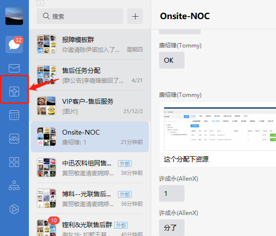
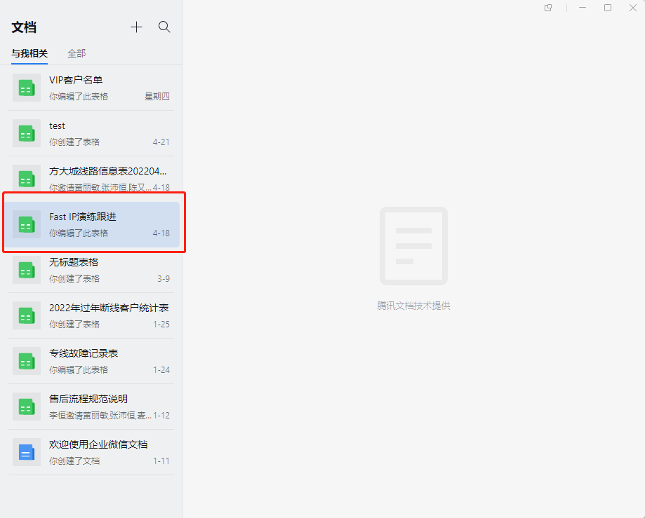

阿里云-光联

SD-WAN项目交付

故障演练报告

**2022-4-14**

■ 版权声明

本文中出现的任何文字叙述、文档格式、插图、照片、方法、过程等内容，除另有特别注明，版权均属光联集团所有，受到有关产权及版权法保护。任何个人、机构未经光联集团的书面授权许可，不得以任何方式复制或引用本文的任何片断。

目录

第1章 ：基本拓扑分析 3

[1.1 网络拓扑图 3](\l)

[第2章 故障演练（2022/4/11） 4](\l)

[2.1  VPNGW故障------主IPSecgw中断 4](\l)

[2.2  控制器故障，转发正常 5](\l)

[2.3  CPE掉电 /硬件故障（瞬断） 7](\l)

[2.4  CPE互联网故障(wan瞬断) 8](\l)

[2.5  CPE LAN故障(lan) 9](\l)

[2.6  CPE流量过载 11](\l)

[第3章 故障演练（2022/4/13） 13](\l)

[3.1 VPNGW故障------主IPSecgw中断 13](\l)

[3.2  CPE互联网故障(wan) 15](\l)

[3.3 CPE掉电 /硬件故障 16](\l)

[3.4  模拟打流测试 18](\l)

：基本拓扑分析
==============

{width="6.267361111111111in" height="4.022222222222222in"}网络拓扑图
------------------------------------------------------------------------------------------------

{width="6.684722222222222in"
height="1.4868055555555555in"}北京站点：配备一台PC，PC与CE之间通过wifi连接，获得的地址为10.0.20.101/24，网关为10.0.20.1/24。

杭州站点：配备一台PC，PC与CE之间通过wfi连接，获得的地址为10.0.19.128/24，网关为10.0.19.1/24。

两个站点之间通过BGP路由宣告，实现了10.0.20.0/24网段与10.0.19.0/24网段的互访。

故障演练（2022/4/11）
=====================

 VPNGW故障------主IPSecgw中断 
------------------------------

> **演练目的：**验证当主IPSec连接故障，流量切换情况
>
> **预期结果：**流量默认走主线路，当主线路down掉后，流量会切换到备线，过程中会短时间地出现丢包情况。
>
> **演练方式：**在北京站点PC（10.0.20.101）与杭州点地wifi网关（10.0.19.1）有数据流量的情况下，由阿里工程师人为地在杭州点的主IPSGW上down掉接口配置，造成主IPSecGW与杭州CE的IPSec连接中断。
>
> **演练过程：**

1.  时间节点4/12 0.06，北京站点ping操作正常，延迟波动范围为42-46ms

    {width="5.590972222222222in"
    height="1.875in"}图2.1.1 数据连接图

2.  时间节点4/12
    > 0.07,阿里工程师down掉上海节点主IPSec连接，数据流量中断，期间CE上bgp连接仍然存活。

    {width="5.611111111111111in"
    height="1.707638888888889in"}图2.1.2 流量中断图

    {width="5.545138888888889in"
    height="0.8444444444444444in"}图2.1.3 bgp状态查看图

    3、时间节点4/12
    0.10（3min）,流量切换到备线进行传输，延迟波动范围为340-380ms，CE上BGP状态为connect

    {width="5.180555555555555in"
    height="1.75in"}图2.1.4 流量恢复图

    {width="4.977777777777778in"
    height="0.8055555555555556in"}图2.1.5 bgp状态图

    **测试结论：**基本符合预期，仍有较大整改空间。

> **整改措施：**PE与CE双方配置的bgp hold
> time时间为默认的180s，造成主备链路流程切换时间过长，预计调整CPE双方关于bgp
> hold
> time参数的配置，以期提高链路的情况检测的敏捷性，缩短链路切换的时间。见下期。

 控制器故障，转发正常
---------------------

> **演练目的：**验证当epoch中控与ce端的控制连接失效时，对数据流量的影响。
>
> **预期结果：**CE与epoch中控的控制连接，不会对CE的数据流量造成影响
>
> **演练方式：**在北京站点PC（10.0.20.101）与杭州点地wifi网关（10.0.19.1）有数据流量的情况下，由光联工程师人为地中断CE与epoch中控的控制连接，造成epoch中控无法登录管理CE设备。
>
> **演练过程：**

1.  时间节点4/11 21.35
    > 北京ping测试正常，在CE上断掉与epoch的控制通道连接，epoch中空上无法连接到CE端。

    {width="4.777777777777778in"
    height="1.8868055555555556in"}图2.2.1 流量状况图

{width="4.8493055555555555in"
height="2.048611111111111in"}

图2.2.2 epoch中控图

2.  时间节点4/11 21.37
    > 恢复CE上与epoch中控的控制连接，过程中流量无影响，查看整个过程中的ping包无丢包情况。

    {width="5.464583333333334in"
    height="2.216666666666667in"}图2.2.3 epoch中控图

    {width="5.513194444444444in"
    height="1.726388888888889in"}图2.2.4 数据包接收统计图

    **测试结论：**符合预期。

 CPE掉电 /硬件故障（瞬断）
--------------------------

> **演练目的：**模拟CE设备短时间掉电的情况，以及对数据流量造成的影响。
>
> **预期结果：**CE掉电过程中，数据流量中断，CE上电短时间内，网络恢复。
>
> **演练方式：**在北京站点PC（10.0.20.101）与杭州点地wifi网关（10.0.19.1）有数据流量的情况下，由阿里工程师，手工拔插CE电源，形成CE短时间经历断电与上电的情况。
>
> **演练过程：**

1.  {width="5.894444444444445in"
    > height="2.6534722222222222in"}时间节点4/11 22.11
    > 北京pc正常ping包，拔掉CE设备电源后一段时间插上

    图2.3.1 数据流量图

2.  时间点4/11 22.13 预计IPSec重启时间为100s左右，数据重新连通。

    {width="5.910416666666666in"
    height="0.9395833333333333in"}图2.3.2 流量中断图

> {width="5.860416666666667in"
> height="1.1805555555555556in"}图2.3.3 bgp状态图
>
> {width="5.284027777777778in"
> height="1.7333333333333334in"}图2.3.4 数据流量恢复图
>
> **测试结论：**符合预期。

 CPE互联网故障(wan瞬断)
-----------------------

> **演练目的：**验证当CE的互联网故障，造成主备IPSec连接中断的数据传输情况。
>
> **预期结果：**CE的wan网络链路中断的情况下，数据流量会一直中断，等到网络恢复，数据流量随即恢复。
>
> **演练方式：**在北京站点PC（10.0.20.101）与杭州点地wifi网关（10.0.19.1）有数据流量的情况下，由阿里工程师，拔插CE端的wan口线路，人为造成网络中断
>
> **演练过程：**

1.  时间节点4/11 21.40 北京pc端ping流量测试正常

    {width="5.339583333333334in"
    height="1.6263888888888889in"}图2.4.1 流量连通图

2.  {width="5.310416666666667in"
    > height="2.4715277777777778in"}时间节点4/11 21.41
    > 短时间内拔插wan口线路，造成数据中断与恢复

> 图2.4.2 流量恢复图
>
> **测试结论：**符合预期

 CPE LAN故障(lan)
-----------------

> **演练目的：**验证当CE端，连接内网的端口down掉后，网络的数据传输情况
>
> **预期结果：**CE的Lan网络链路中断的情况下，连接此端口的pc数据流量会一直中断，等到网络恢复，数据流量随即恢复。
>
> **演练方式：**在北京站点PC（10.0.20.101）与杭州点地wifi网关（10.0.19.1）有数据流量的情况下，由光联工程师人为地down掉北京点的wifi接口，照成连接在此接口上的pc网络中断。
>
> **演练过程：**

1.  {width="5.423611111111111in"
    > height="1.6715277777777777in"}时间节点4/11 21.43
    > 北京站点ping测试正常，短时间内在ce上down/up
    > wifi接口,造成lan口中断。

    图2.5.1 数据连通图

2.  时间节点 4/11
    > 21.45恢复WiFi接口up状态，持续一段时间未恢复连接，pc端wifi已从其他ap获取IP，重新连接CE端WiFi（21.48）即可正常通信。

    {width="5.402777777777778in"
    height="3.24375in"}图2.5.2 数据中断图

    {width="5.430555555555555in"
    height="1.7847222222222223in"}图2.5.3 数据恢复图

    **测试结论：**符合预期

 CPE流量过载
------------

> **演练目的：**验证当组网链路上存在大量数据时，对正常业务数据的影响情况
>
> **预期结果：**当网络内出现大量数据时，数据流量整体时延会出现可接受范围的上升。
>
> **演练方式：**在北京站点PC（10.0.20.101）与杭州点地wifi网关（10.0.19.1）有数据流量的情况下，由光联工程师与阿里云工程师，联合使用iperf3工具，形成大量流量数据传输，查看大流量数据形成后对原本的ping数据的整体时延影响情况。
>
> **演练过程：**

1.  时间节点4/11 22.29
    > 北京pc作为iperf3的服务端，杭州CE作为iperf3客户端，向北京pc发起udp流量。北京pc出现丢包和乱序的情况

    {width="5.832638888888889in"
    height="2.6631944444444446in"}{width="5.8875in"
    height="3.8027777777777776in"}图2.6.1 iperf3发送端状况图

    图2.6.2 iperf3 接收端状况图

> **测试结论：**不符合预期
>
> **整改措施：**演练过程中出现报文丢失，失序的情况，通过初步排查，判定数据传输过程中，本地带宽导致的丢包失序情况，接下来可以搭建新的实验场景，对流量满载情况的，流量传输质量进行再次测试。

故障演练（2022/4/13）
=====================

VPNGW故障------主IPSecgw中断 
-----------------------------

> **演练目的：**验证当主IPSec连接故障，流量切换情况
>
> **预期结果：**流量默认走主线路，当主线路down掉后，流量会切换到备线，通过配置BGP的hold-time时间为15秒，预计断线与切换的时间会持续15s。
>
> **演练方式：**在北京站点的pc（10.0.20.101）向杭州站点CE（10.0.19.1）进行ping包测试，过程中，down掉杭州站点主线（上海线）的IPSec连接，观测流量数据切换情况.
>
> **数据观测记录：（下述时间节点并非真实时间，重在探测时间间隙）**
>
> 通过在北京点ce上对端口进行抓包，实时查看接口的数据流量转发情况。

图一数据显示，由10.0.20.1\<------\>10.0.19.1的数据流量正常转发。截至时间点：14：10：00，之后进行上海线路中断。

图二数据显示，由14：10：00至14：10：25这段时间，北京的主IPSec虚拟接口上都未有10.0.20.1\<------\>10.0.19.1的流量，至14：10：25之后开始出现连续的实验数据流量，整个过程共持续15s，符合实验预期。

**测试结论：**基本符合预期，仍有整改空间

**整改措施：**当主线恢复后，流量由备线切换回主线，经实验测试结果来说，大概一分种。需要根据实际情况调整配置参数，缩短由备线回切向主线的时间。

> **数据截图：**

{width="5.909722222222222in"
height="1.9861111111111112in"}

图3.1.1 ping流量来回正常

{width="6.4847222222222225in"
height="5.721527777777778in"}

图3.1.2 流量切换时间图

{width="6.052083333333333in"
height="2.5208333333333335in"}

图3.1.3 流量稳定情况图

 CPE互联网故障(wan)
-------------------

> **演练目的：**验证当CE的互联网故障，造成主备IPSec连接中断及恢复的数据传输情况。
>
> **预期结果：**CE的wan网络链路中断的情况下，数据流量会一直中断，等到网络恢复，数据流量经过一段时间恢复。

**演练方式：**在杭州站点PC（10.0.19.128）与北京点的wifi网关（10.0.20.1）有数据流量的情况下，由阿里工程师，拔插CE端的wan口线路，过程持续5分钟，人为造成网络中断。

**数据观测记录：（下述时间节点并非具体时间，重在观测时间间隙）**

时间记录：杭州pc与北京CE数据传输正常，12:12，拔掉wan口，模拟网络中断，过程持续5分钟。

插回wan口网线时间为17：06

互联网（114.114.114.114）通的时间为17：19

中控连接时间点19：54

BGP状态切换为establish时间为，22.06/27

Ping流量测试连通时间22.40

综上，拔掉网线至数据流量恢复的时间共持续5m36s，其中，互联网连接上的时间为13s，中控连接时间为2m48s.

**测试结论：**不符合预期

**整改措施：**ipsec的IPSec
sa存活性和重连机制在当前配置下错误，同时IPSec协议本身在此不够完善。使用新配置可以缓解此处问题，后续将发布补丁从根本上解决。

{width="6.038194444444445in"
height="2.2256944444444446in"}

图3.2.1 杭州pc与北京CE数据传输正常

{width="6.295138888888889in"
height="1.4875in"}

图3.2.2 杭州ce上查看BGP connect状态持续5分钟。

{width="6.383333333333334in"
height="4.189583333333333in"}图3.2.3 IPSec存活时间查看为22m51s

CPE掉电 /硬件故障
-----------------

> **演练目的：**模拟CE设备长时间掉电之后数据连接的恢复情况。
>
> **预期结果：**CE掉电过程中，数据流量中断，CE上电经过一段时间后，私网互访正常。
>
> **演练方式：**在杭州站点PC（10.0.19.128）与北京点地wifi网关（10.0.20.1）有数据流量的情况下，由阿里工程师，手工拔插CE电源（过程持续3分钟），形成CE经历持续一段时间的断电与上电的情况。

**数据观测记录：（下述时间节点并非具体时间，重在观测时间间隙）**

32：30，由阿里工程师拔掉杭州ce站点电源。

35：30，阿里工程师插回杭州ce站点电源

37：00，公网通（114.114.114.114），同期IPSec sa连接成功

37：37，控制平面连接成功

39：13 pc与CE之间的数据连接通路

综上：从上电到数据连通时间共持续4m13s，其中从启动到连接公网花费1m30s，连接公网之后接上控制平面花费37s，连接公网之后数据连通花费2m13s。

**测试结论：**基本符合预期，仍有较大改进空间

**整改措施：**在IPSec sa
up知道VPN胡同存在较大的时延，需要与阿里工程师再次场景复现，并协同诊断，后续发布补丁解决问题。

{width="6.049305555555556in"
height="1.663888888888889in"}

图3.3.1 杭州pc与北京CE数据连接成功

{width="6.0368055555555555in"
height="1.5708333333333333in"}图3.3.2 BGP连接成功

{width="6.035416666666666in"
height="3.5388888888888888in"}

图3.3.3 于38：15查看IPSec以启动1m6s，预计启动时间为37：07

 模拟打流测试
-------------

> **演练目的：**组网链路能否在100M的数据传输情况下，进行数据的稳定传输
>
> **预期结果：**当网络内出现100M/s的数据时，数据基本能够稳定传输，丢包情况在可接收范围内。
>
> **演练方式：**两台ce分别连接到两台pe，ce之间使用iperf工具进行大流量模拟
>
> **数据观测记录：**100M的测试环境的打流，模拟北京到杭州的测试环境，打流100M
> 实际能够达到到91M。（考虑本地链路的传输情况，基本符合预期）

{width="5.208333333333333in"
height="3.095138888888889in"}

图3.4.1 iperf使用tcp进行大流量模拟

{width="5.125in"
height="2.6041666666666665in"}

图3.4.2 iperf使用udp进行大流量模拟

**测试结论：**符合预期
