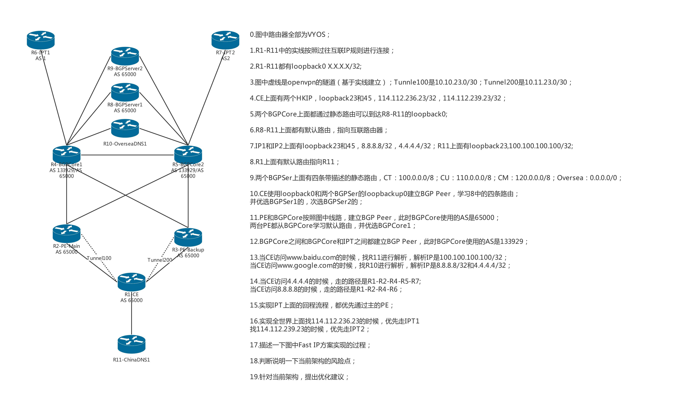

|0001.jpg|

0.图中路由器全部为VYOS；

1.R1-R11中的实线按照过往互联IP规则进行连接；

2.R1-R11都有loopback0 X.X.X.X/32;

3.图中虚线是openvpn的隧道（基于实线建立）；Tunnle100是10.10.23.0/30；Tunnel200是10.11.23.0/30；

4.CE上面有两个HKIP，loopback23和45，114.112.236.23/32，114.112.239.23/32；

5.两个BGPCore上面都通过静态路由可以到达R8-R11的loopback0;

6.R8-R11上面都有默认路由，指向互联路由器；

7.IP1和IP2上面有loopback23和45，8.8.8.8/32，4.4.4.4/32；R11上面
有loopback23,100.100.100.100/32;

8.R1上面有默认路由指向R11；

9.两个BGPSer上面有四条带描述的静态路由，CT：100.0.0.0/8；CU：110.0.0.0/8；CM：120.0.0.0/8；Oversea：0.0.0.0/0；

10.CE使用loopback0和两个BGPSer的loopbackup0建立BGP
Peer，学习8中的四条路由；

并优选BGPSer1的，次选BGPSer2的；

11.PE和BGPCore按照图中线路，建立BGP Peer，此时BGPCore使用的AS是65000；

两台PE都从BGPCore学习默认路由，并优选BGPCore1；

12.BGPCore之间和BGPCore和IPT之间都建立BGP
Peer，此时BGPCore使用的AS是133929；

13.当CE访问www.baidu.com的时候，找R11进行解析，解析IP是100.100.100.100/32；

当CE访问www.google.com的时候，找R10进行解析，解析IP是8.8.8.8/32和4.4.4.4/32；

14.当CE访问4.4.4.4的时候，走的路径是R1-R2-R4-R5-R7；当CE访问8.8.8.8的时候，走的路径是R1-R2-R4-R6；

15.实现IPT上面的回程流程，都优先通过主的PE；

16.实现全世界上面找114.112.236.23的时候，优先走IPT1
；找114.112.239.23的时候，优先走IPT2；

17.描述一下图中Fast IP方案实现的过程；

18.判断说明一下当前架构的风险点；

19.针对当前架构，提出优化建议；

