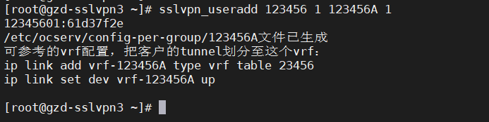

====================================================
**模板-图文解释**
====================================================

标题1
=====

标题2
-----

文字填充

|image0|

配上文字说明

**表格**

=================== ===================================================================================== ===
POST /devices/apply Add replace device API                                                                Yes
=================== ===================================================================================== ===
POST /devices/apply tunnels method - Add advanced tunnel options to meta section. mtu, mssClamp, ospfCost Yes
GET /tunnels        Add interface and devId to response                                                   Yes
=================== ===================================================================================== ===

.. _标题2-1:

标题2
-----

文字文字文字

.. _标题1-1:

标题1
=====

文字文字文字

.. _标题2-2:

标题2
-----

文字填充

|image1|

文字填充

