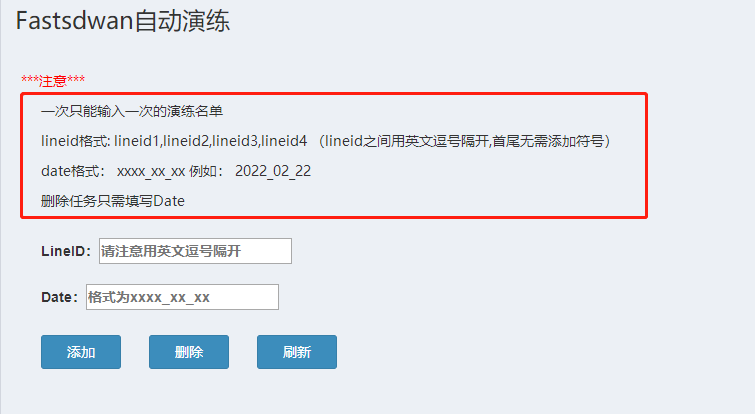
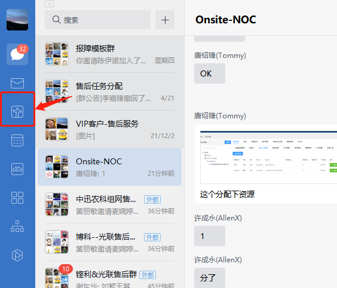
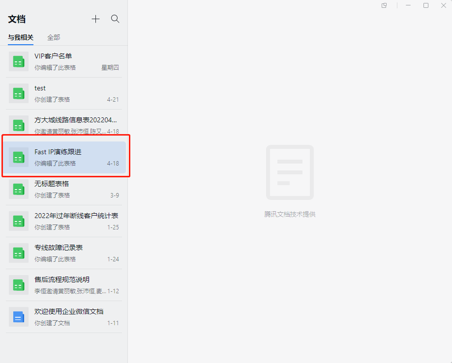

=========================
夜间演练操作SOP及注意事项
=========================

Fastsdwan演练是为了减少因各种原因导致主备切换不成功，当发生故障时\ **减少对客户业务造成影响为目的**\ 的前期工作。**感谢系统组为爱发电制作的自动演练脚本**

演练前准备工作
--------------

1.1进入演练网页
---------------
具体网址和账号密码，找主管要

打开网址输入账号密码后

点击自动化管理

|image0|

具体各个文件作用和下载地址均已标识情况，请自行理解

|image1|

进入连接后下载对应需求名单

如名字

**已演练名单**\ ：Drill_results.xlsx
--即已经演练过的名单，里面的类别包括：
1、不规范（数据不完整）
2、演练前后不一致（NO，也就是重点对象）
3、演练前后一致（分三类：全部通、全部不通、部分通）

**未演练名单**\ ：no_drill_results.xlsx--未演练名单，添加任务事需要筛选吗，排除vip，shutdown、off等名单。

1.2添加任务
-----------

|image2|

如图所示，添加任务有格式要求

例：LineID：605044A1,601773B10,602663A3,600512B7,600512C4,600512M5

Date：2022_5_10

要求值班期间每天5-10个进行演练。

演练完成后的修复动作
====================

打开已演练名单

|image3|

第一阶段是先将演练结果为NO的名单进行修复

夜班同事需要讲NO为结果的记录，输出在企业微信共享文档内的《Fast
IP演练跟进》文档

具体操作如下：

|image4|

|image5|

注意：要注意格式

贴上后的朋友可以，尝试修复CE配置，如发现BGPIP为旧香港IP的统一更换为最新的BGPseverIP。

配置修复后，需要再次在夜间请NOC同事做主线shutdown测试，检验修复结果。

.. |image0| image:: ../imgs/media/image1.png
   :width: 5.76528in
   :height: 2.81389in
.. |image1| image:: ../imgs/media/image2.png
   :width: 5.76458in
   :height: 1.47083in

