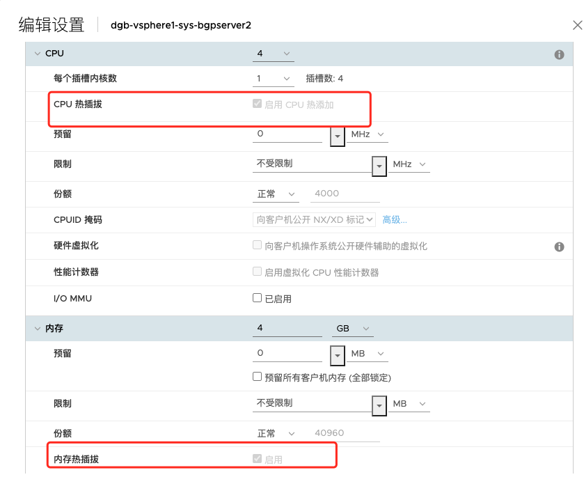
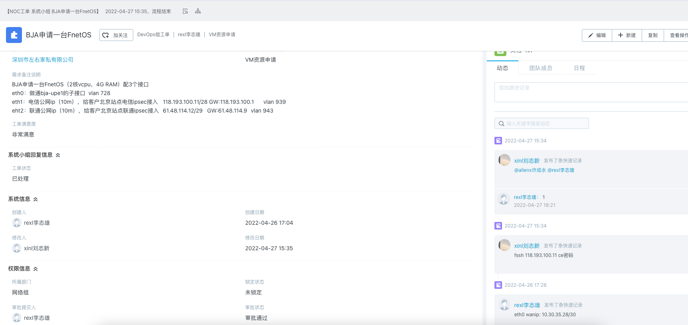

##################
开虚拟机操作流程
##################
开虚拟机操作流程
================

工单需求
--------

收到系统工单后，需要确认以下几个信息：需要开在所属机房、VM归属者、VM的操作系统、VM的配置需求（包括网卡、cpu、内存、硬盘、分区）

**表格**

============ ========================================================== ===
所属机房     说明需求所需的机器资源                                        Yes
============ ========================================================== ===
VM归属者     需要说明需求VM的归属者，是骨干还是客户；是测试还是正式使用       Yes
VM的操作系统 必须是明确的操作系统，如centos7.9，fnetlink2.1.7等             Yes
VM的配置需求 网卡：说明需求的网卡数量、必要时提供ip                         Yes
                                                                       
             cpu、内存、硬盘、分区：如（2H4G内存50G硬盘，默认分区）    
============ ========================================================== ===

获取到工单需求，根据需求进行开虚拟机的操作。

**1、首先要确定所需VM所在的机房**，如果无要求，可按照我们目前服务器资源相对比较充足的地方开设VM，默认配置，如果工单需求没有写明白，默认配置为2H2G内存20G硬盘，centos7.9系统。（登录链接、账号密码可找系统组同事要）

**2、确定所需VM的服务器在哪里**，骨干所需要VM资源开设在集群上，客户或者测试资源，逻辑上应开在单机版服务器上；如果该机房没有集群，全部需求都开单机版服务器上面。

**虚拟机命名规则**：机房宿主机类型+归属者+vm用途；如：dgb-vsphere1-sys-ctdns1

**机房宿主机类型**：一般是有机房名称+（vsphere（集群）/vmware（单机）/pve（集群）/proxmox（单机））

**归属**：有sys，pe，cli，test四种类型

**vm用途**：骨干使用则由具体功能用途来命名，客户使用的话则由客户cid来命名

**3、开好机器后，要把cpu、内存开启热添加。**如下图：

|image0|

4、**骨干类的服务器，做好服务VM的标准化，回复工单，客户类的服务器开设好之后回复工单。**

|image1|

